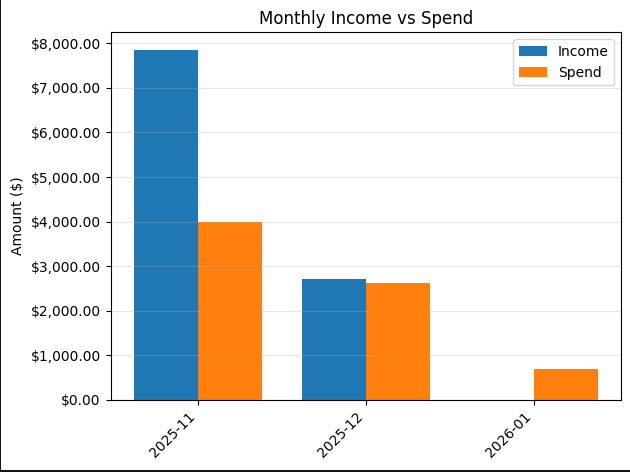

# Personal Finance ETL & SQL Analytics

A portfolio project that demonstrates a full **ETL + SQL analytics workflow** using bank transaction data.

This project takes raw transaction CSV exports, standardizes them into a consistent format with Python, loads them into a SQLite database, and analyzes spending/income trends with SQL in Jupyter notebooks.

---

## Project Goals

- Import and clean bank transaction CSV data
- Normalize different bank export formats into one schema
- Store cleaned data in SQLite
- Run SQL-based analysis for spending and income trends
- Create charts for reporting (monthly spend, income vs spend, etc.)
- Keep private financial data out of GitHub

---

## Skills Demonstrated

### Python (Pandas / Jupyter)
- CSV ingestion
- Data cleaning and normalization
- Handling multiple column-name formats across bank exports
- Money parsing (`$`, commas, parentheses negatives)
- Sign normalization (expenses vs income)
- Reusable ETL logic via config-based schema handling

### SQL (SQLite)
- Schema design
- Aggregations (`SUM`, `COUNT`)
- Conditional logic (`CASE WHEN`)
- Grouping by month
- Joins (transactions, merchants, categories)
- KPI-style reporting (income and spend)

### Data Analyst Workflow
- ETL pipeline design
- Data validation checks
- Reproducible notebook-based analysis
- Portfolio-friendly reporting and visuals

---

## Project Structure

finance-analytics/
- `README.md`
- `.gitignore`
- `requirements.txt`
- `data/`
  - `raw/` *(ignored; real bank CSVs go here)*
  - `sample/`
    - `sample_transactions.csv` *(fake/sample data for demo)*
  - `finance.db` *(ignored local SQLite database)*
- `notebooks/`
  - `01_load_clean.ipynb` *(ETL / cleaning / loading)*
  - `02_sql_analysis.ipynb` *(SQL analysis + charts)*
- `sql/`
  - `schema.sql` *(SQLite table definitions)*
- `src/`
  - `bankschema.py` *(config-driven CSV normalization logic)*
- `output/`
  - charts / exports (optional)

---

## How It Works

### 1) Extract
A CSV export is loaded from:
- `data/raw/transactions.csv` (your personal file, ignored by Git), or
- `data/sample/sample_transactions.csv` (provided sample file)

### 2) Transform
Python standardizes the file into a common schema:
- `date`
- `description`
- `amount`
- `Pending`

The ETL logic supports multiple bank formats using alias-based configs in `src/bankschema.py`, including:
- signed amount files (one `Amount` column)
- separate debit/credit files
- files that use a separate credit/debit indicator column for sign

### 3) Load
Cleaned records are inserted into a local SQLite database (`data/finance.db`) using the schema in `sql/schema.sql`.

### 4) Analyze
SQL queries in `02_sql_analysis.ipynb` calculate:
- monthly spend
- monthly income
- income vs spend comparisons
- category and merchant summaries (optional extensions)

---

## Setup (Local)

### 1. Create and activate a virtual environment
**Windows (PowerShell)**
- `python -m venv .venv`
- `.\.venv\Scripts\Activate.ps1`

**macOS/Linux**
- `python -m venv .venv`
- `source .venv/bin/activate`

### 2. Install dependencies
- `pip install -r requirements.txt`

### 3. Launch JupyterLab
- `jupyter lab`

### 4. Run notebooks in order
1. `notebooks/01_load_clean.ipynb`
2. `notebooks/02_sql_analysis.ipynb`

---

## Data Privacy

This project is designed to analyze **bank transaction data**, so I intentionally keep private financial data out of version control.

### What is excluded from GitHub
The following are ignored via `.gitignore`:
- `data/raw/` (real bank CSV exports)
- `data/finance.db` / `*.db` (local SQLite databases created during analysis)
- `.venv/` (local Python virtual environment)
- cache/checkpoint files (Python and Jupyter)

### What is included in GitHub
To make the project reproducible without exposing personal data, this repo includes:
- a **sample/fake transactions CSV** (`data/sample/sample_transactions.csv`)
- SQL schema (`sql/schema.sql`)
- normalization logic (`src/bankschema.py`)
- Jupyter notebooks (`notebooks/`)
- project dependencies (`requirements.txt`)

### Reproducing the analysis locally with your own data
1. Export your transactions as CSV from your bank
2. Place the file in `data/raw/` (this folder is ignored by Git)
3. Run the load/clean notebook, then the SQL analysis notebook

This keeps personal financial information private while still demonstrating the full ETL + SQL analysis workflow.

---

## Example Analyses Included

- **Monthly Spending**
  - Total expense by month (reported as positive values for readability)
- **Monthly Income vs Spend**
  - Side-by-side bar chart comparing income and spending
  

---

## Notes on Bank CSV Variability

Bank exports are not standardized. Different institutions may use:
- different column names (`Date`, `Transaction Date`, `PostedDate`, etc.)
- different amount formats (signed amount vs debit/credit columns)
- separate type indicators (`Credit Debit Indicator`, `Type`, etc.)
- optional pending columns

To handle this, the project uses a configurable schema mapping approach in `src/bankschema.py`.  
New formats typically require updating or adding a small config entry rather than rewriting the ETL logic.

---

## Future Improvements

- Auto-detect bank config from CSV columns
- Rule-based merchant/category enrichment
- Category spend dashboard
- Rolling averages and trend metrics
- Export summary tables to CSV for BI tools
- Add unit tests for normalization logic

---

## Why This Project Matters (Portfolio Context)

This project reflects a real analyst workflow:
- messy input data
- repeatable cleaning/standardization
- reliable SQL metrics
- clear visual reporting
- privacy-aware data handling

It demonstrates both technical skills (Python + SQL) and data handling discipline that are valuable in a data analyst role.